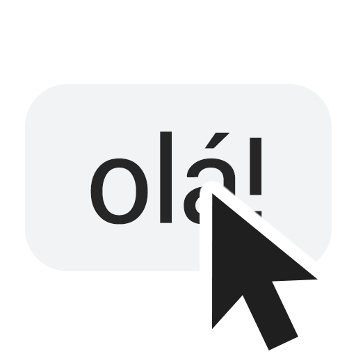

# Hi! I'm Enzo!

A developer passionate about turning problems and challenges into code, creating solutions that improve people's lives and make everyday life simpler and more fun.

> You should visit my personal site to learn more about me and check my projects 👉 https://enzon19.com

## About

I'm a **full-stack web developer** and a **Computer Science student** at Universidade Federal de Juiz de Fora (UFJF). I live in Brazil, where I create **websites, platforms and online tools, messaging bots, browser extensions and desktop applications**. I also have experience with **image and video editing**.

I started programming at 11 and, without a doubt, **programming is my passion!** I can't see myself doing anything else. I'm currently very interested in exploring web development further and learning about native application development for mobile and desktop devices.

## Skills

- **Languages:** JavaScript, TypeScript, HTML, CSS
- **Frameworks & runtime:** Tailwind CSS, Svelte, SvelteKit, Node.js, Bun, Electron
- **Databases & tools:** PostgreSQL, Supabase, Git
- **Image & video editing:** Photoshop, Premiere Pro, After Effects

  

  

## Featured Projects

- ###  Dicionário Bot
  A Brazilian Portuguese dictionary on Telegram.

  [Website](https://dicionariobot.enzon19.com/) • [Telegram](https://t.me/dicionariobot) • [GitHub](https://github.com/enzon19/dicionariobot)
- ###  Quick Reply Meet
  Send messages in Google Meet™ chat without typing.

  [Website](https://quickreplymeet.enzon19.com/) • [Chrome Web Store](https://chromewebstore.google.com/detail/quick-reply-meet/dodpcgfhomjldnenagdibjcoofheocfc) • [GitHub](https://github.com/enzon19/quick-reply-meet)
- ###  ReverseTV
  Discover other roles played by each actor based on your Trakt history.

  [Website](https://reversetv.enzon19.com/) • [GitHub](https://github.com/enzon19/reversetv)
